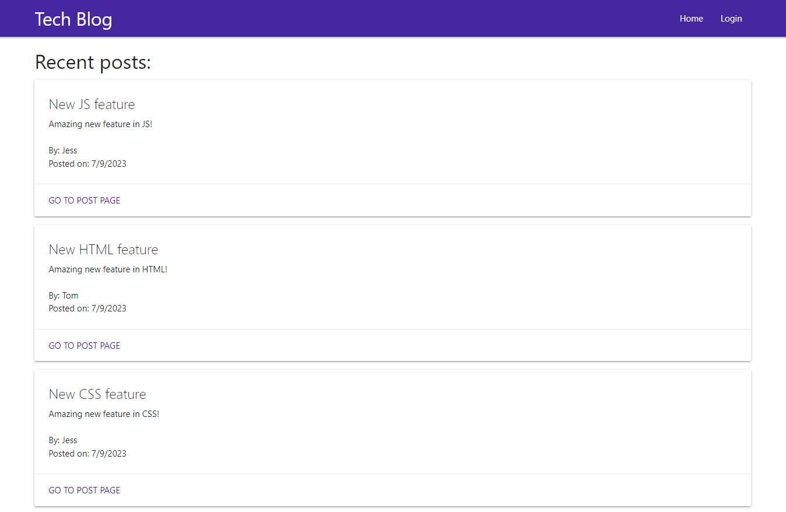
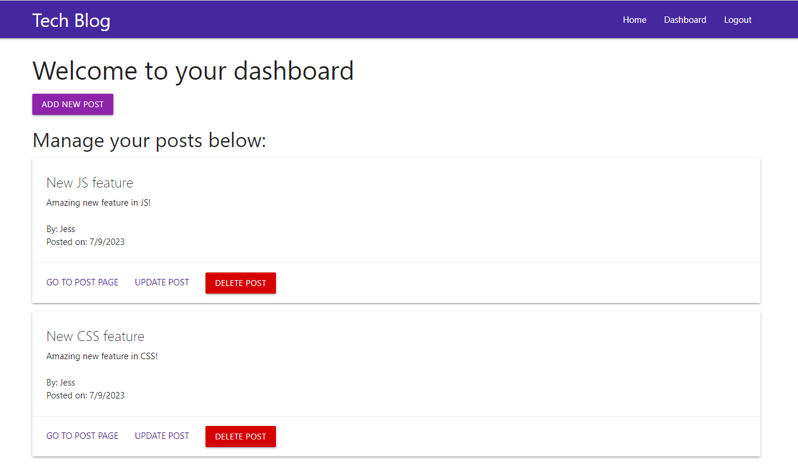

# Tech Blog


## Description 

CMS-style blog site where developers can publish their blog posts and comment on other developers’ posts as well. This app follows the MVC paradigm in its architectural structure, using Handlebars.js as the templating language, Sequelize as the ORM, and the express-session npm package for authentication.

Link to deployed application: https://shrouded-dusk-91199-379bcd75a9dc.herokuapp.com/

## Table of Contents

- [Installation](#installation)
- [Usage](#usage)
- [Questions](#questions)
- [License](#license)

## Installation

To install necessary dependencies, run the following command:

```npm i```

## Usage

When visiting app for the first time, on the homepage, user able to see all the posts. However, to get access to personal Dashboard to post, update and delete blog posts as well as to write comments, user needs to login. 

Example homepage when user is not signed in: 

 

Example of Dashboard when user is signed in: 

 

## Questions
GitHub profile: [vlada-caban](https://github.com/vlada-caban)

## License 
License: MIT